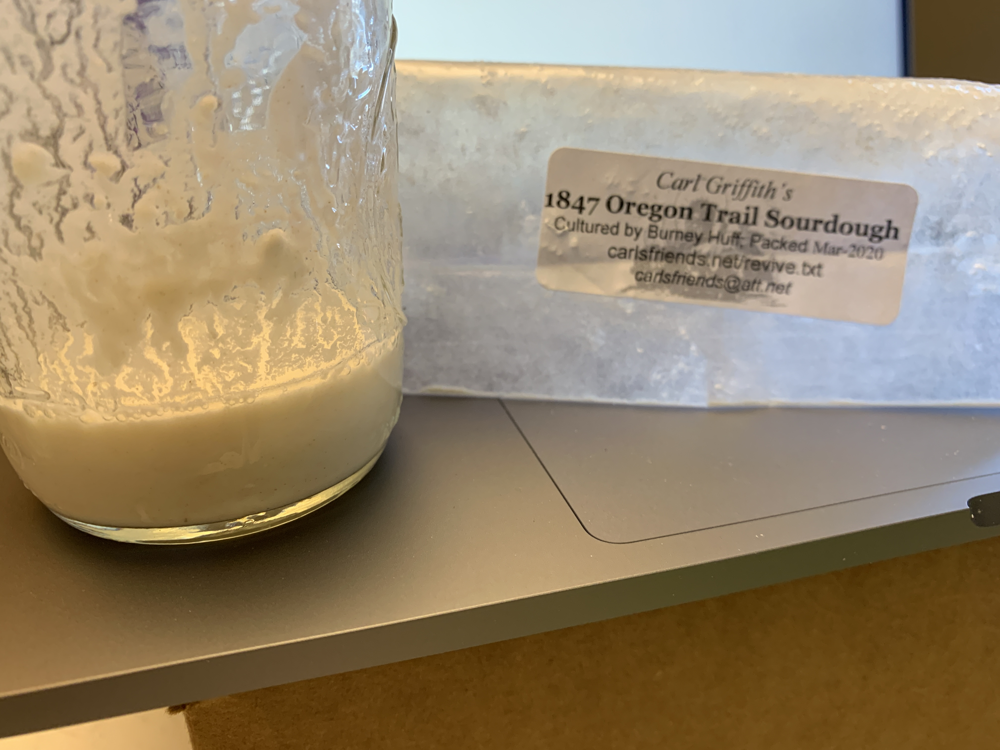

## Baking bread is easier than you think; or, Loaves in the Time of Corona
Dan Conley

2020-05-22

(quarantine day 68)

("Loaves in the Time of Corona" coined by Curtis Duhn and I love it so much)

## Problem statement
1. My family loves bread

2. You should avoid going to the grocery store as much as possible right now
    * and my family was in quarantine for some of this

3. Bread does not last long, so buying in bulk is infeasible
    * frozen bread is gross don't even suggest it

## Solution: make bread!
1. Fresh bread is awesome

2. The ingredients are _cheap_

3. Plus I like being all homestead-y and DIY and stuff

## Bread: four ingredients and security
by weight:

1. flour
2. water
3. salt
4. yeast

## Next problem
* everyone else has this idea

* yeast can be hard to come by

* (especially because [Caren deserves all of it, none for us johnny-come-latelys](https://twitter.com/kinematografi/status/1256366240341397505))

## Next solution: sourdough
* People have been baking bread for long before we knew what yeast even _was_ (first observed in 1680, not widely commercially available in the US til 1876)

* A "sourdough starter" is a collection of yeast and Lactobacillus (probiotic, "live and active cultures")

* Keep it "fed" and reproducing _ad infinitum_ by adding flour and water

* So, once you have a starter, the only yeast-related ingredients you need are flour and water

## Bread: revised
by weight:

1. flour
2. water
3. salt
4. (flour + water)

and okay you'll probably want some butter to spread on there for extra deliciousness but it's not strictly _required_

# Let's make some bread

## Before we begin
Some caveats:

* I'm no expert! This is subsistence, not craft, for me.

* There are many ways to make bread; this is but one

* I'm following the basic process in _Flour, Water, Salt, Yeast: The Fundamentals of Artisan Bread and Pizza_ by Ken Forkish

## General process of bread development
1. Mix ingredients
2. Develop gluten
3. Bulk fermentation (first rise)
4. Shaping and second rise
5. Bake

## One: mix ingredients
* Optional, but highly encouraged, is to mix the flour and water together first and let sit for 20-30 minutes

* This is called _autolyse_ and helps with gluten development (you're helping with step two!)

* Then, y'know, get everything all up in there. Use your hands! Keeping them wet stops the dough from sticking to you

* You can do steps 1-3 in one large plastic container for less cleanup!

## Two: develop gluten
* Think of the structure of dough as a pile of bricks that was dumped on the ground. You're aligning them into a wall.
* You can knead it, by hand or using a dough hook and a mixer
* Or you can use extra water and time ("no knead" was popularized in _Artisan Bread in Five Minutes a Day_ by Jeff Hertzberg and Zoe Francois)
* _Flour Water Salt Yeast_ and most sourdough recipes do a hybrid, called "stretch and fold"

## Stretch and fold
* Grab an edge of the formless mass that is your dough
* Stretch it up as far as it will go without tearing
* Fold it over the top of the dough
* Rotate 90 degrees and do it again
* Once you have a rough ball of dough, pick it up and flip it over
* Let it rest for 20ish minutes and do it again (ie Hulu commercial breaks)
* The number of folds required depends on the bread: my basic one is 3-4

## Three: bulk fermentation
* Here you let the yeast go forth and multiply, eating the carbohydrates and pooping out alcohol and carbon dioxide
* You're welcome for that visual
* This is the same thing that happens with beer, but the alcohol produced is minimal. Instead the CO2 makes it rise!
* Sourdough rises overnight: less yeast and more time makes it more sour, or more yeast and less time for less.

## Four: shaping
* Being as gentle as possible (so as to not pop all those bubbles that are going to make it nice and airy) split it into two pieces

* For a sourdough boule do a rough series of folds and put it in a floured banneton or bowl

* I am not good at this part. It still makes bread.

## Four: second rise
* Let it rise more (or "proof", like "here's the proof the yeast is working"), but not too much!

* Sourdough's slower fermentation makes the window between under- and over-proofed more forgiving

## Five: bake
* Ideally in a ceramic dutch oven, which you should have anyway
* Make large pots of beans and rice, or chili
* My love affair with cast iron borders on illicit
* Oh right we were talking about bread, sorry

## Five: bake
* Slice designs on top if you want; I keep it _au naturel_
* For 30 minutes covered, so the steam stays trapped and works its magic on the crust
* Then 10-25 minutes uncovered or until it's nice and brown but not burned
* It recommends 475* but ovens are different. I've had better luck with 470 and 10-15 for browning.

## Surprise sixth step: chill out
* It will still bake internally when you take it out!
* Don't eat it right away! No! Bad Tech Talks participant. Shoo.
* It also makes this really great cracking noise as it cools

## Why baking your own sourdough bread is great
* Cheap
* On demand
* Easy
* Tasty

## Downsides
* You do need a dutch oven and maybe some bannetons (though bowl + kitchen towel works as well)
* You need to plan ahead, which I am chronically unable to do right now

## Rough schedule
| time | step |
| ---- | ---- |
| 8 pm | autolyse |
| 8:30 pm | mix |
| 8:45 - 10 pm | folds |
| 10 am | shape |
| 12 pm | bake |
| 1:30 pm | eat |

# Obtaining and caring for your sourdough starter
I am probably out of time but just in case!

## Getting a starter
* Buy one: I think King Arthur flour sells some?
* Get it from someone you know. Hey, I'm somebody you know! Once we can see each other again.
* Get it from [Carl's friends](https://www.carlsfriends.net/), for the cost of a self addressed stamped envelope
    * This is what I did! I'm surprised it came so quickly, but this was in March.
* Make your own! Flour, water and the natural yeast that's everywhere

## Maintaining
* You want to feed it at least twice a day, roughly doubling its weight
* Equal parts flour and water by weight (2:1 flour:water by volume)
* Anyone _remotely_ good at math will see this is unsustainable
* So you _remove half_, then double its weight
* Use the removed part for bread, [pancakes](https://www.farmhouseonboone.com/our-favorite-sourdough-pancakes-recipe) (_delicious_), fry it as-is... throw it away if you have to

## Storing
* Baking twice a day is not really viable when you have things like "a job" and "a desire to eat something that isn't bread"
* So feed it, and then put it into the fridge
* At least once a week you need to bring it back to room temperature and feed it

(and here is where, if we could see each other, there would be samples. but we can't, so there aren't.)
