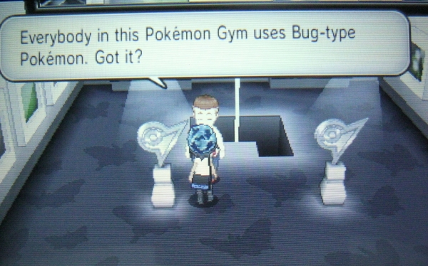
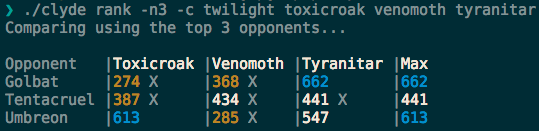

# clyde: a go CLI to make me the best there ever was

Dan Conley

August 2019


## Warning
This is about Pokemon Go again.

If you don't like that, sign up to do presentations!


## So. Pokemon Go PVP tournaments.
* You pick six Pokemon (there may be theme restrictions)

* Each round you make a team of three from those six

* You see your opponents' six and they see yours


## I want to be &c
* How do you choose the best six?

* Given your opponent's six, what do you bring?


## Wine in front of me
Let's say Toxicroak is the best lead in Twilight Cup. (it's not, but go with me)

1. I'll lead Toxicroak
2. You know I'll lead Toxicroak, so you lead Venomoth to counter Toxicroak
3. I know you know I'll lead Toxicroak, so I'll lead Tyranitar to counter Venomoth
4. You know I know you know I'll lead Toxicroak, so you lead Toxicroak to counter Tyranitar

...on and on and on, like a mobius ouroboros.


## All that is to say
* You cannot win with math alone.

* There's also when to store energy, shield, switch, etc.

* It's *not just tapping faster*, shut *up* Twitch chat during Pokemon Worlds!


# But math can help


# How can you choose the best six?


## Enter PvPoke
* [PvPoke.com](https://pvpoke.com)
* Simulates battles between Pokemon
* Generates rankings for each cup
* See who's "best", their optimal movesets, who they do well and poorly against, etc.
* Also simulate battles, either vs a specific opponent or an entire cup


## PvPoke is the PGo PVPer's holy text
* Generates "battle rating" for a 1v1 matchup (below 500 = lose)

* Basically any discussion on Discord, YouTube, etc references it.

* If you want to get started, just look at their lists

* But be careful of legacy moves! Umbreon may be ranked highly, but *only* with Last Resort!


## And think of team composition
* Six Pokemon of the same type won't do you any good!

* There are infographics, generally, which can help


# But anything worth doing is worth overdoing
## : The dconley story


## Get some csvs
* When doing X vs an entire cup, you can export the results as a CSV
* It includes the Battle Rating of each matchup, as well as whether you survive
* My first cup I entered in the IVs\* and moves of each Pokemon, then downloaded the csv
* Then imported them all into one mega-csv and wrote macros to highlight each matchup

<small>\* [see previous DevTricks, true believer! -ed.]</small>


## But that's boring, make a robot do it
Think about these steps.

1. Go to a website
2. Enter some data
3. Download a file
4. Parse the data from a file


# Enter clyde


# clyde?


## Remember this guy?


Gives advice before Pokemon battles. In gen 5 he's named Clyde.


## clyde
* Written in go (please, try to hide your shock)
* Uses [github.com/spf13/cobra](https://github.com/spf13/cobra)
* Also [text/tabwriter](https://golang.org/pkg/text/tabwriter/)
* So before I talk about Pokemon stuff some more let's get into some coding stuff


## github.com/spf13/cobra
* Library for creating CLI apps/interfaces with flags, subcommands, etc
* If you've written go you *probably* know about it?
* Sister repo to [viper](http://github.com/spf13/viper)
* Used in the synscreen server!
* If you're making a cli app that takes more than 1-2 args, check it out


```go
func init() {
	rootCmd.AddCommand(info)
}

var info = &cobra.Command{
	Use:   "info",
	Short: "Get the stats/moves for a pokemon",
	Args:  cobra.ExactArgs(1),
	Run:   runInfo,
}

func runInfo(cmd *cobra.Command, args []string) {
	p, err := pokemon.Load(args[0])
	if err != nil {
		fmt.Printf("%s doesn't appear to be a Pokemon I know about", args[0])
		os.Exit(1)
	}

	w := tabwriter.NewWriter(os.Stdout, 5, 2, 0, ' ', tabwriter.AlignRight)
	fmt.Fprintln(w, p.Info())
}
```


## text/tabwriter
> Package tabwriter implements a write filter (tabwriter.Writer) that translates tabbed columns in input into properly aligned text.

* Part of the standard library!
* I had never heard of it!
* Makes formatting tables really nice!




The pipes are "debug" but I like them so I keep them on


## tabwriter usage
* Give it an `io.Writer` (ie `os.Stdout`) and some padding info, it returns a writer
* Write to it (using ie `fmt.Fprint()`) using column delimiters (ie tabs)
* Then call `Flush()` on your tabwriter object and it formats [elastic tabstops](http://nickgravgaard.com/elastictabstops/index.html) and prints to the writer you gave it


## tabwriter caveat
* It doesn't ignore bash color escape sequences
* `\e[31mhi\e[0m` will display as two characters (`hi`)
* But tabwriter thinks its length is 13, so tabs will look off
* A workaround is to make sure every field has the same *amount* of escaping, even if the color is white


## Back to clyde
* Started off as, essentially, an easier-to-script csv
* I now store my Pokemon's information as yaml, for reuse in other cups
* Can display any number of mine vs the top N opponents (as ranked by PvPoke)
* Or I can filter by specific Pokemon, so I can see how my 6 do against my opponent's!


## And more!
* PvPoke uses path parameters/htaccess rewrites to allow for deep linking of matchups. And is [open source](https://github.com/pvpoke/pvpoke).
* So I [cracked the code](https://blog.theconley.club/dan/pvpoke-multi-battle-url-parameters)
* And now my `calculate` command opens nine tabs, for each of the (0-2),(0-2) shield permutations
* I still have to manually scroll to and click the "Download CSV" button -- *like a goddamned Neanderthal* -- but could theoretically use Selenium or something to automate everything


## Is this legal?
* Are you a cop? You have to tell me if you're a cop.
* Yes. I value playing fairly over winning.
* Before a tournament it's just studying
* There's currently no rule against using tools mid-tournament. If that changes I won't use clyde once it starts.
* I also don't use it during the KenTon cups, because I'd be making my opponent wait.


## Does it make me better?
* I think so! I have a better handle on what *my* Pokemon (rather than the ideal one with perfect stats and moves) can do.
* It helps me plan and realize that I have to protect X because it's my only answer to Y
* But it doesn't tell me what to choose, or how to play
* And I'm currently doing pretty abysmally in this month's tournaments
* But imagine how godawful I'd be *without* clyde!


# Live demo!
