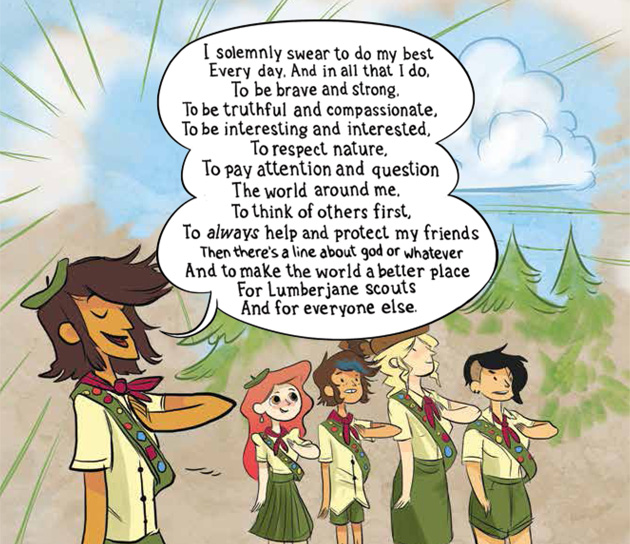
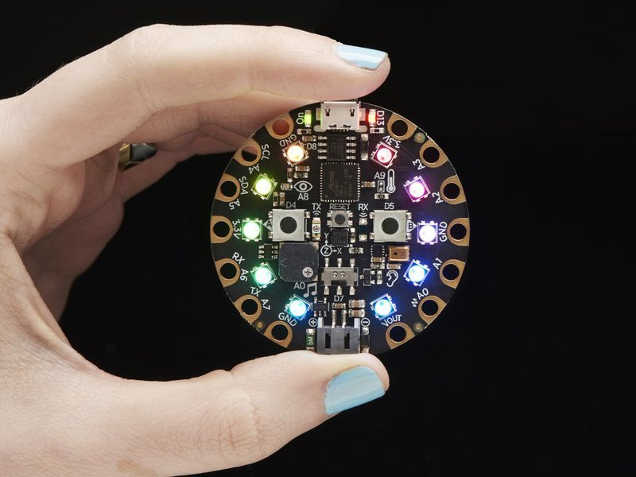

# The Six Million Dollar Pinewood Derby Car
Dan Conley

February 2018

## I'm a Cubmaster
* We don't hate th' gays now!
* Or th' trans!
* Soon we'll even be cool with th' girls!
* Still not cool with atheists, but, like just mumble those parts

## The Pinewood Derby
* You probably know about it: it's in the zeitgeist
* Sorry, th' zeitgeist
* Get a block of wood, some nails and some plastic wheels, make a car
* Race the cars!
* Some people get very into it!

<iframe width="560" height="315" src="https://www.youtube.com/embed/-RjJtO51ykY?rel=0" frameborder="0" allow="autoplay; encrypted-media" allowfullscreen></iframe>

## "So you hijacked your kid's project?"
* *No!*
* Pack 539 did a parent and sibling derby this year too
* My son did his all on his own, except for the power tools, and it was, uh, unique
* I got to geek out, however
* (I suppose I am never not geeking out, because I'm me, but)

## Guess what I'm talking about Adafruit again
* I meant to cancel my Adabox subscription because I was moving and didn't need to spend money
* But I didn't
* So I got Adabox006, which contains a CircuitPlayground Express and some other nifty bits
* (I'm not cancelling yet, because 007 is going to be "spy themed", and... c'mon)
* Plus: [CircuitPython](https://github.com/adafruit/circuitpython)!

## CircuitPython
* A fork of [MicroPython](https://github.com/micropython/micropython), which runs Python on microcontrollers
* The board shows up as a drive and you write directly to it
* Plus you get a REPL!
* It's slower than Arduino/C++, sometimes much slower. But it's easier to learn and to get on the board.
* [`import antigravity`](https://www.xkcd.com/353/)

## The CircuitPlayground Express
* 10 LEDs (Neopixels)
* accelerometer
* temperature sensor
* light/color sensor
* sound sensor
* IR transceiver
* speaker
* two buttons, a slide switch and pads that can use capacitive (touch) input

For $25, if you're buying one board, buy a CPX.

## Let's do a derby car... with data!
* Cars experience momentum
* There's 2MB internal storage on the CPX (I ran out of space on the last slide)
* Why not log accelerometer data for the runs?
* Stick an OLED screen on there and display in real time!

## Plus flashing lights
* Flashing lights are cool.
* Cub Scout colors are blue and gold, so use blue and yellow
* 4 blue/4 yellow that rotate
* And LED headlights because *why not*

## The design
* Everything removable so I can reuse it
* Magnets to attach the CPX
* Space for a lipo battery
* Holes for headlight wires
* [Copper foil tape](https://www.adafruit.com/product/1128) would look like racing stripes...
* And make it look vaguely Delorean-like because *why not* (plus less sanding for a blocky design)

# Montage break!

## Minimum Viable Pinewood
* The cuts were rough, so I used a chisel, and chiseled away part of the windshield. I chiseled the other side and think it looks good.
* I accidentally sprayed gray paint over the black and shiny silver, instead of the clear coat. Whoops.
* The wires are loose, making it delicate and prone to the display turning off.

## Disaster strikes
* On the test/weigh-in day I ran some test races
* ...no data!
* You have to have it in read-only mode for the code to write (switch toggled right), but it was!
* I'll try to fix it in the week before the derby

# And then I moved.

## So no fancy graphs
* I *really* wanted fancy graphs
* `:(`
* `;_;`
* `D:`

## Final thoughts
* Though it didn't turn out perfectly, it was a lot of fun!
* Started with a fairly solid idea and finalized as I went
* Probably the most thorough project I've done so far
* Had all the pieces except for the OLED (and I had *an* OLED)
* To do it from scratch would be $50-75 maybe

## Final thoughts
* Reusability (not soldering the wires to the CPX) hurt the functionality, but I'd prefer it solder free
* Alligator clips would have been better, but put me over the weight limit
* Nobody really cared about the data but me
* The kids really liked the design (which is maybe all that matters?)

# Live demo (...ish)

# The end!
## Questions?
