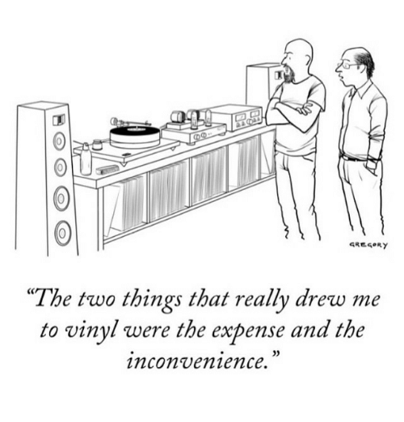

# Tracking my record spins with Vue and the Discogs API
Dan Conley

March 2020

## But no really I love vinyl
* I don't care about the "warmth" or whatever
* But I like the physicality of it
* Nice to look through an actual shelf full of things while deciding what to listen to
* You have to be _present_ while listening: at most you get ~25 minutes before you need to flip the record

> Vinyl has returned to being a priority for us - not just for the warmth of the sound, but the interaction it demands from the listener. The canvas of artwork, the weight of the record, the smell of the vinyl, the dropping of the needle, the difficulty of skipping tracks, the changing of sides, the secrets hidden within, and having a physical object that exists in the real world with you… all part of the experience and magic.

> Digital formats and streaming are great and certainly convenient, but the ideal way I’d hope a listener experience my music is to grab a great set of headphones, sit with the vinyl, drop the needle, hold the jacket in your hands looking at the artwork (with your fucking phone turned off) and go on a journey with me.

Trent Reznor

## My listening setup
* In my office
* I basically only listen when I'm working from home

## COVID-19 has entered the chat
* Hey I'm, uh, working from home now. A lot.
* And I have a lot of records, some of which I haven't listened to in a long time
* How many can I get through before the world starts again?

## Discogs
> We're on a mission to build the biggest and most comprehensive music database and marketplace. Imagine a site with discographies of all labels, all artists, all cross-referenced, and an international marketplace built off of that database. It's for the love of music, and we're getting closer every day.

* I use [Discogs](https://discogs.com) for tracking my collection (and occasionally buying things)
* And they have an api...

## Why even be a software engineer if you don't shape reality to your every whim?
* I still want to play around with Vue
* So I tossed together a quick site!
* Basically still at MVP stage, but the V does stand for "viable"!

## Interlude
* Maximum Vinyl Purchasing
* Mandatory Vinyl Playback
* Music? Very Pleasing
* Moving Vocal Passages

ok im done

## Behold!

## A website!
* [discogs.danconley.net](http://discogs.danconley.net) (https coming... soon?)
* Uses vue, bootstrap-vue and... that's pretty much it
* Have to use a "personal access token" because their api doesn't have an implicit grant
* And adding a back end just for oauth seems like oa-verkill
* Doesn't store any data, everything via localstorage

## A website! ctd
* Displays your collection by added date
* Filter by album/artist name
* Limit to only unlistened
* Click "Listened to" to mark it as listened

## Where to store the information?
* I started with a localstorage array
    * but then it's per-device
* Then I started using the Discogs "Notes" section
    * But I sometimes use Notes for other stuff
    * So I was doing weird string parsing to extract the playcount and last played

## Custom Notes!
* Then I stumbled across custom note fields
* Name 'em whatever you want!
* Unfortunately you can't create them via the api
* But once you create the ones I require...
* Fields for "Listens" and "Last Listened"!

You can even see it in your Discogs collection!

## Future work
* Display when you last listened to something
* Maybe sort by that?
* View the Discogs entry for a release from the card
* Scrobble to last.fm? (but last.fm's api is godawful)

## The end!
* This presentation written while listening to Ariana Delawari's _[Lion of Panjshir](https://www.discogs.com/Ariana-Delawari-Lion-Of-Panjshir/release/14729818)_
