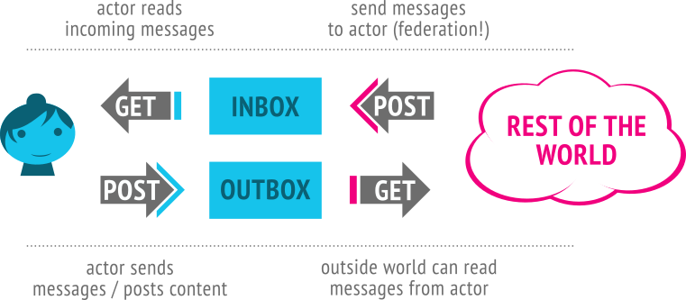

# Team Butterfly in the Sky
## Building a decentralized book-based social network
Dan Conley, Matt General, Devon Brodka

## Statements
1. Books are good
2. Friends are good
3. The internet is ~~go~~okay

## We've lost the promise of the web
* Decentralized!
* Weird corners for you and your friends to hang out!
* Remember webrings??

## Let's make it better
* How about Goodreads, except not owned by Amazon
* So we made it
* (y'know, mostly. we had 20 hours)

## What we did beforehand
* looked into ActivityPub spec
* Contacted go-fed developer
* Brainstormed names (dconley, not group)

## What we did now
* Create a site to search for books
* Uses [OpenLibrary](https://openlibrary.org/)'s API
* Created a [go package](https://github.com/exlibris-fed/openlibrary-go) to search, retrieve book details, view covers
* CD to production (https://exlibris.social)

## What else we did!
* Backend allows for registration, login, reading a book
* Federation is nearly there

# What is federation?

## go fed is a library, but
* wrote nearly 1,000 lines of code
* plus handling JWTs
* it handles federation, but you need to supply interfaces

# LIVE DEMO TIIIIIME
