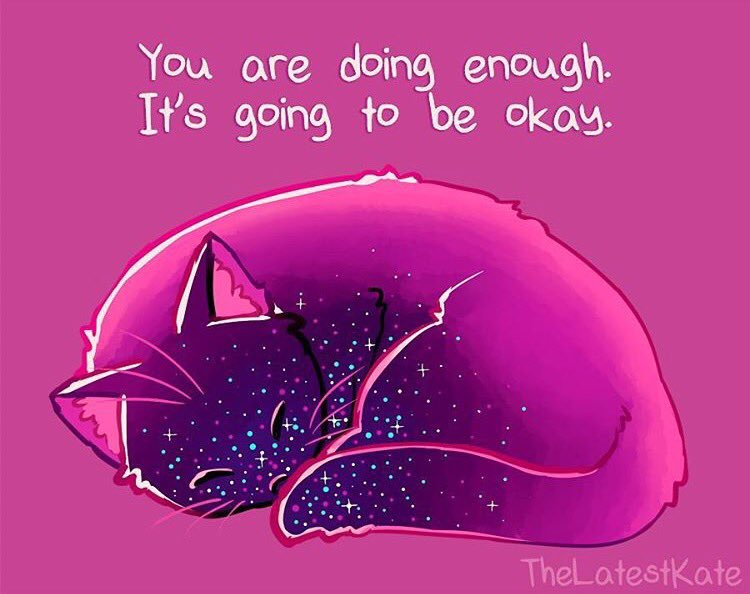

# Impostor Syndrome
## Or: You're pretty great
### (even if you don't believe it)

Dan Conley

It all started in a bar.

At 2 am. Roughly.

And I sheepishly admitted that I had been to RIT for a year.

## Here's the thing
You are all *really freaking smart*

Like, "[people think you're cheating at Advent of Code](https://www.youtube.com/watch?v=ajRF2ca99-c)" smart

"[*Wrote* the damn Advent of Code](http://adventofcode.com/)" smart

"[Here's 15 minutes about how shadows are calculated in video games](http://slides.com/tdhoward/shadow-rendering-techniques#/)" smart

## I'm just zis gender-nonspecific-guy, you know?
* Bachelor of Arts (History), Buff State, 2005

* Master of Library Science, UB, 2007

* Self taught PHP, git, etc (though knew fundamentals of programming)

* Came from an office with four people, where I had to *leave post-it notes explaining how to power cycle a router* when I went on vacation

It's possible you knew I was not classically trained

It's unlikely you knew I had started to be before dropping out

## Back to the bar
> Oh. You've got impostor syndrome.

> Impostor syndrome (also known as impostor phenomenon or fraud syndrome) is a term coined in 1978 by clinical psychologists Dr. Pauline R. Clance and Suzanne A. Imes referring to high-achieving individuals marked by an inability to internalize their accomplishments and a persistent fear of being exposed as a "fraud".

(continued)

> Despite external evidence of their competence, those exhibiting the syndrome remain convinced that they are frauds and do not deserve the success they have achieved. Proof of success is dismissed as luck, timing, or as a result of deceiving others into thinking they are more intelligent and competent than they believe themselves to be. Some studies suggest that impostor syndrome is particularly common among high-achieving women.

\- [Wikipedia](https://en.wikipedia.org/wiki/Impostor_syndrome)

## Things you think about yourself
<ul>
<li class="fragment">What I do isn't special</li>
<li class="fragment">Everyone knows everything I do and more (for instance, why do a talk on impostor syndrome when everyone already knows what it is)</li>
<li class="fragment">Anyone can do what I do if they just learned it</li>
</ul>

## Essentially, you feel like this sloth

## The opposite of Dunning-Kruger

## The best* part
* Being terrified of coming across as Dunning-Kruger so you always undermine yourself!
* You say ["sorry"](http://www.nytimes.com/2015/06/23/opinion/when-an-apology-is-anything-but.html?_r=0) and ["just"](http://women2.com/stories/2014/02/17/just-say) a lot
* (but remember there's a difference between encouraging confidence and [criticizing women](http://nymag.com/thecut/2015/07/can-we-just-like-get-over-the-way-women-talk.html))

## Implications
* Selling yourself short
* Being a bad teacher ("everyone knows" something so you don't include it)

## Case study: my age
> You're 32??

<table>
<tr>
<th scope="col">I think</th>
<th scope="col">He things</th>
</tr>
<tr>
<td>
<ul>
<li class="fragment">I'm old</li>
<li class="fragment">I have accomplished relatively little</li>
</ul>
</td>

<td>
<ul>
<li class="fragment">I've accomplished so much</li>
<li class="fragment">I have two kids</li>
</ul>
</td>
</tr>
</table>

## Ways to combat your evil meatsack brain
<ul>
<li class="fragment">You do not have to be the best or perfect</li>
<li class="fragment">The people you admire probably feel this way sometimes</li>
<li class="fragment">Keep a list of accomplishments</li>
<li class="fragment">Have managers give good goals/reviews (shoutout to rmanzella)</li>
<li class="fragment">Never underestimate the power of therapy and good ol' fashioned SSRIs</li>
</ul>

<iframe width="560" height="315" src="https://www.youtube.com/embed/1i8ylq4j_EY" frameborder="0" allowfullscreen></iframe>

# You are not worthless

# You are not broken

# You are not alone

