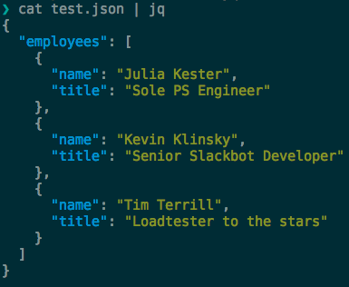

# jq
## Or: I came up with this at the last second and didn't have time to think of a witty subtitle

Dan Conley

November 2019


## JSON
* Javascript Object Notation

* it's like XML but you can look at it with your human eyes and understand it

* or, at least, sometimes


## JSON
```json
{
	"employees": [
		{
			"name": "Julia Kester",
			"title": "Sole PS Engineer"
		},
		{
			"name": "Kevin Klinsky",
			"title": "Senior Slackbot Developer"
		},
		{
			"name": "Tim Terrill",
			"title": "Loadtester to the stars"
		}
	]
}
```


## JSON (more frequently)
```json
{"employees":[{"name":"Julia Kester","title":"Sole PS Engineer"},{"name":"Kevin Klinsky","title":"Senior Slackbot Developer"},{"name":"Tim Terrill","title":"Loadtester to the stars"}]}
```


## Pretty printing is already available
* At least one of `json_xs` or `json_pp` should be installed everywhere

* `json_pp` can also convert between formats (like YAML)

* And is Perl, so that should make you happy


# But what if you need to do more than just read it?


## Enter jq (it says in parenthesis)
> jq is like sed for JSON data - you can use it to slice and filter and map and transform structured data with the same ease that sed, awk, grep and friends let you play with text.


https://stedolan.github.io/jq/


## It pretty prints... with _color_!


(audience: "ooooooh")


## It slices, it dices
```
> cat test.json | jq '.employees[].name'
"Julia Kester"
"Kevin Klinsky"
"Tim Terrill"
```


## Extract only the fields you care about
```
> curl -s 'https://api.github.com/repos/zimbra/zm-mailbox/commits?per_page=5' \
  | jq '.[] | { author: .author.login, sha, message: .commit.message }'
{
  "author": "rupalid",
  "sha": "1929b242acb2dbf49b31d0c053f52bd174e7ff24",
  "message": "Code review comments"
}
{
  "author": "rupalid",
  "sha": "9d930551ee687763c24d7fa4493fe0607be84d9a",
  "message": "ZBUG-987 Fixing NPE"
}
{
  "author": "yashrajpchavda",
  "sha": "b5780737c4af1458414b6822b3dde55975fa872f",
  "message": "ZXL-158: add value for zimbrax in zimbraPrefClientType to be allowed it to be set as default client"
}
{
  "author": "dasiyogesh",
  "sha": "086b2f9ee57b4f10f44370fbf016a5b1c30122ad",
  "message": "ZCS-7964: migrating license changes from zimbrax of zcs 7809"
}
{
  "author": "desouzas",
  "sha": "f50fb71023162570258b9b24309bb3b649f88c00",
  "message": "ZCS-7949 Fix NPE in ProxyServlet response. (#965)"
}
```


## jq syntax
```
> cat github.json | jq '.[] | {
  author: .author.login,
  sha,
  message: .commit.message
}'
```

* `.[]`: for every item in the array (can also do `.[0]`)
* ` | {}`: pipe the results into another filter
* `author: .author.login`: rename the field (for valid JSON)


## Basic functions
* `length` of arrays: `cat github.json | jq length`
	* if it's an object key: `jq '.entries | length`
	* (have to pipe it to a second filter)

* `keys` of objects: `cat github.json | jq '.[0] | keys`
	* you _can_ look at every item in the array but it'd give you the keys for each


## Get fancy with conditionals
`cat github.json | jq '.[] | select( .author.login == "rupalid" ) | { message: .commit.message }'`

Filter out any result not by the user `rupalid`


## And more!
* `map`
* `reduce`
* `foreach`
* variables
* functions
* recursion!


## Things I use it for regularly
* pretty printing
* exploring the structure of the response via `keys`
* filtering out only the parts of a response I care about


## More advanced use cases
```
curl "http://synacor.content-stream1.svcs:4080/1/content/feed/gen4_for_you_mobile/glados/" \
  | jq '[.items[]
  | select(.type == "cluster" or .type == "clusterWithoutHero")
  | {
      length: .cluster_assets | length,
      type,
      assets: [{
        video_available: .cluster_assets[].data.video.available,
        renditions: .cluster_assets[].data.image.renditions
        }]
    }]'
```


## Exploring JSON? There is another way!
`cat github.json | json_pp | vim -`

* Pretty prints, then lets you edit in vim
* ~~Downside: you have to use vim~~
* Bonus: you get to learn vim!
* You could maybe use a different editor, but _why would you_
* `zfi{` and so on for folding objects you don't care about


# Somebody do a DevTricks on vim actions
They changed my _life_


## If I may get sappy
* My first DevTricks was my second week here
* My last was my penultimate week
* Even outside of it, I've learned _so much_ from coworkers, past and present (see: piping to vim)


## The real free pizza was the friends we made along the way
* DevTricks is in good hands
* Keep this going: it's always been the best part about working here


# Thank you
