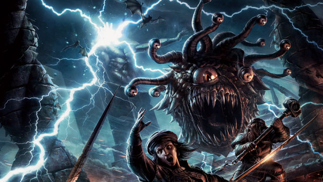

# Merge Conflicts And You
## Practical magicks for headache resolution
Dan Conley

9/2016

## How a merge happens
Base:

	$a = 1;
	
	echo $a + 1;

## How a merge happens
Branch A:

	$a = 1;
	
	echo $a + 1;
	echo $a * 2; (New)

Branch B:

	$a = 3; (Changed)
	
	echo $a + 1;

## How a merge happens
Merged:

	$a = 3; (Branch B)
	
	echo $a + 1;
	echo $a * 2; (Branch A)

## Merge conflicts
Branch A:

	$a = 2; (Changed)
	
	echo $a + 1;

Branch B:

	$a = 3; (Changed)
	
	echo $a + 1;

Which change do you take?

## A common merge conflict
Branch A

	[
		'existing' => 'something',
		'new'      => 'something else', (Added)
	]

Branch B

	[
		'existing' => 'something',
		'also_new' => 'a third thing', (Added)
	]

Both change the line after `'existing'`: which should exist?

## The answer
Both, of course. This is a simple fix! Just edit the conflicted file to have both branches' changes.

## Anatomy of a conflicted file
Changes in a conflicted file have this format:

	<<<<<<<
	(things added in Branch A)
	=======
	(things added in Branch B)
	>>>>>>>

There can be multiples of these in a file if there are multiple points of conflict.

## The conflicted example

	'existing' => 'something',
	<<<<<<<
	'new'      => 'something else',
	=======
	'also_new' => 'a third thing',
	>>>>>>>

## Fixing a merge conflict
* Edit the conflicted file to make it work with both branches' changes.

* In the above example, and many merge conflicts that we have, this is easy! Both changes should be there, so remove the conflict markup and call it a day.

* Be sure to remove the `<`, `=`, and `>`s! Otherwise you've replaced a merge conflict with a syntax error.

* Commit your changes and push again.

## Explanations from people who are smarter than me
* https://githowto.com/resolving_conflicts
* https://help.github.com/articles/resolving-a-merge-conflict-from-the-command-line/

## In conclusion
Merge conflicts can be scary, and they can be a pain, but generally for us it's a simple fix.

Don't be afraid to ask for help, but armed with this knowledge you should be well equipped to deal with most merge goblins, orcs and bugbears.

Just run away from the merge beholders.

## The end

> "This ticket hasn't had a commit in six months! Merge, merrrrrrrrge!"
