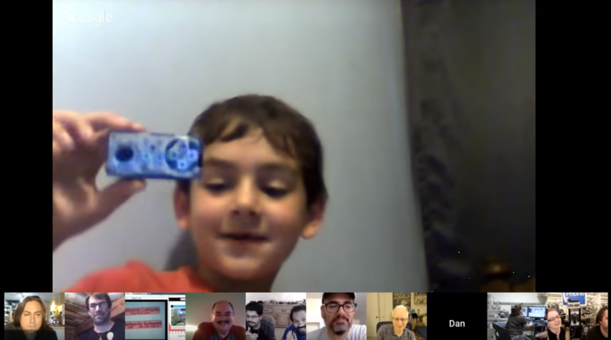
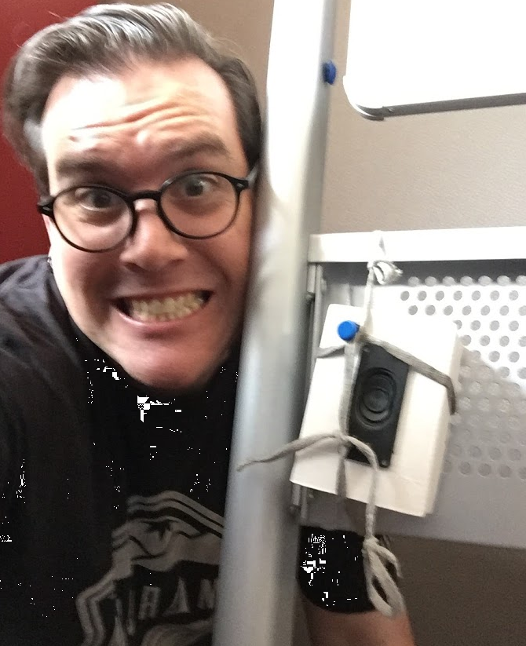
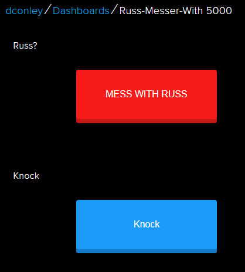
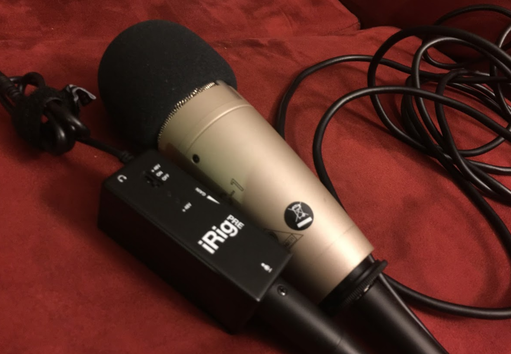
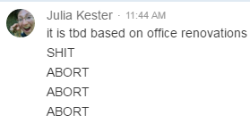
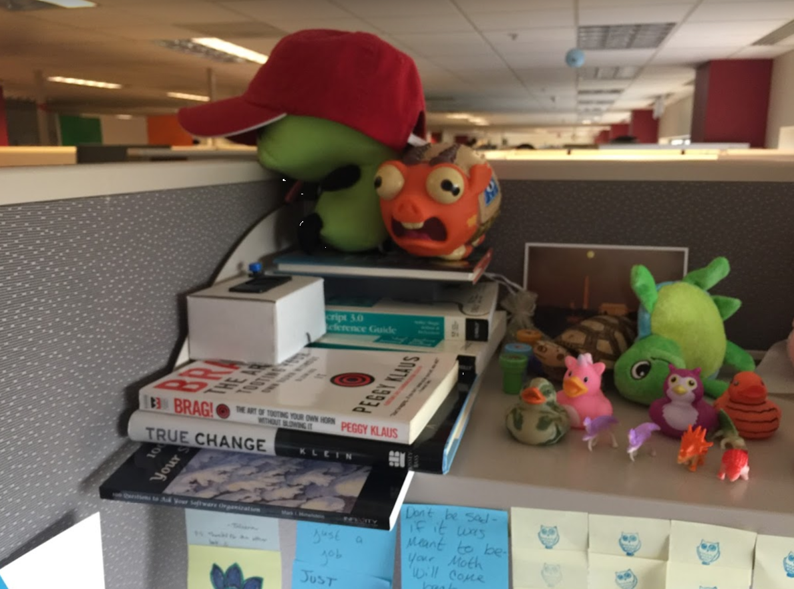
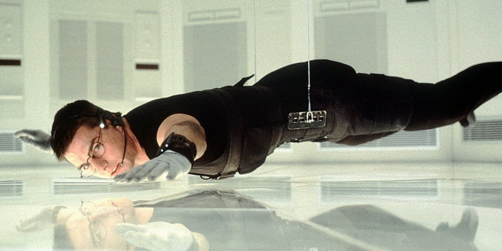

# Using microcontrollers for ~~evil~~ chaotic neutral
Dan Conley

## The Adabox 004
* What it is
* What I made
* What I did with it

## Adabox
* Quarterly subscription box from Adafruit
* ([Adafruit](https://www.adafruit.com/): NYC-based electronics company)
* Theme boxes, each one has everything you need

## Adabox 004
* ["Making things move"](https://learn.adafruit.com/adabox004)
* Feather HUZZAH (ESP8266 based wifi-enabled microcontroller)
* MusicMaker Featherwing (add on that plugs into the Feather, adds speaker terminals and SD card)
* SD card
* 3W speaker
* Cardboard box
* Other things I didn't use

## Speakerboxxx
* First project: streamed Icecast/Shoutcast radio (maybe another Devtricks soon)
* Then a Pikachu soundboard (hence the button)
* Finally, an internet connected soundboard...

## The pseudocode
* Connect to speaker
* Connect to SD, count files in two directories
* Connect to Adafruit.io (IOT dashboard/feeds/triggers)
* Listen to two feeds, when triggered play the next clip in the relevant directory

# None of this seems evil?

# What do you do with an internet connected soundboard?

Hide it in your boss' cube and give his employees the dashboard

## The Mess With Russ (MWR): Genesis
* It's all Christina's fault
* Russ is awesome and a good sport
* Conspiracies are fun

## The two feeds
* `hello`: "Hey Russ?", "Hi...", etc
* `knock`: knock knock knocking on cubicle's door

## Booking a meeting room for this nonsense is hard
* I can't exactly say "you need to get out, I have this room"
* Seriously though I had Mohawk booked wtf

## The day-of
* Julia asking for help
* Gaurav's 1x1
* Changed position to be louder

## It's quiet... too quiet
* We basically were slamming those buttons
* Jaya made sure his headphones were off
* At one point it glitches out and emmitted a high tone (sorry about that)
* Thankfully Russ was oblivious ("well that's annoying")

## Extractions
* Grabbed, reset
* Then it wasn't going well, so I took it back for diagnostics

## Volume code
* `setVolume(int left, int right)`: "lower is louder", but was it?
* I wrote a quick script to loop from 0-10
* (turns out it goes to 256 so that wasn't going to be much different)
* It had been 10, but 0 was *maybe* louder? I set it to 0

## Wait
* My post-boot test was significantly quieter!
* Went back in and explicitly `setVolume(0, 0)` before each clip
* Wow, it's actually loud now!

## Time to put it back

## The discovery
* He may have known from the first post-volume adjustment
* Subtle may have been better? But it wouldn't have been discovered and I was impatient.
* Eventually he asked in chat what to do with a bomb
* Don't destroy it, there's like 50 bucks worth of components in there!

## The reaction
* I wouldn't have done it if I thought he wouldn't like it! But, still, there's a risk.
* He thought it was funny

## And his teams worked together!
* One meeting
* Four recorded voices
* Three people running interference
* A dedicated chat room
* Jaya's personal hotspot

## Plus we're internet-famous now
* Went on Adafruit Show & Tell the night before
* They sort of tied it in to Jobs & Woz on Ask An Engineer?
* We both got stickers

## The JSON License

> The Software shall be used for Good, not Evil.
