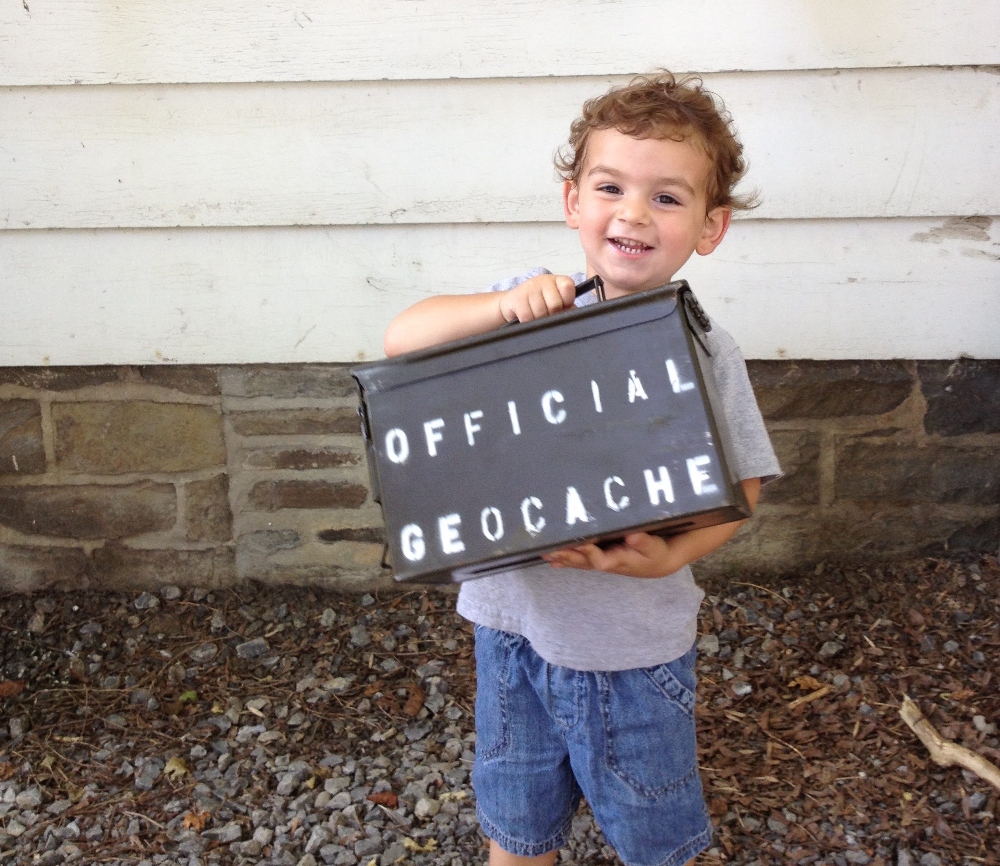

# Treasure Hunting in the Great Outdoors
Dan Conley

## Things I like
* Being outside (in the shade)
* Adventure! (for free)
* Not talking to other people
* Secrets, clubs and shibboleths
* Spending time with my kids

# Hunt the first: Geocaching

## The general idea
* You're given GPS coordinates and a general size of the cache
* Go to there, find the cache
* Sign the logbook and maybe take a trinket/leave a trinket
* If Muggles are around, don't draw attention to yourself
* This is a treasure hunt using technology and Harry Potter terminology so don't lie to me and say you aren't interested

## A variety of locations and sizes
* In urban centers
* In forests
* As small as a thimble
* As large as an ammo box
* Some are multi step: the coordinates lead you to more coordinates (damn you, [Shoshone Multi](https://www.geocaching.com/geocache/GCT3C6_shoshone-multi?guid=683a43b5-444b-4d45-8877-ab1316afe0a6)!)

## General tips
* Look for natural hiding places: holes in trees, undersides of magnetic surfaces
* Look for unnatural hiding places: something placed to obscure what's behind it
* I stg 80% of *Amherst Bee* newspaper boxes have hide-a-keys
* Don't be an idiot (make sure the box you're fiddling with *doesn't* say "rat poison" on it)

## Downsides
* Mobile app is now subscription-based
* You could get a list of coordinates beforehand, or maybe use the site, but...
* Because of this I haven't done any in years

# Hunt the second: Geohashing

## The general idea
* Each day an algorithm generates GPS coordinates
* You go to there
* Have fun?
* "Spontaneous Adventure Generator"
* Made by Randall Monroe in xkcd

## The more specific idea
* Using the date and the Dow Jones opening, generate twelve digits which are appended (six for latitude, six for longitude) to your graticule
* ie 543164 and 754984 (2018-09-14)
* Adding to our graticule (42, -78) to get `42.543164, -78.754984` (Wyandale; northwest of Springfield)
* Farther north? `43.543164, -78.754984` (middle of Lake Ontario, almost over the international border). East? `42.543164, -77.754984` (Dansville)

## A confession
* I have never actually done a geohash
* A lot of them are on private property and/or more than a quick drive away
* The *idea* is cool, though, and I wanted to understand the hash!
* I looked at a few calculators and none of them used html5 geolocation
* Being me, I made my own

## My implementation
* [danconley.net/geohash/](https://danconley.net/geohash/)
* Auto fills GPS position and date
* If on iOS, links to Apple Maps. Otherwise, Google Maps.
* Very low featured, basically MVP proof of concept
* But now I understand exactly how it works!
* And learned how to do hexadecimal fractions

## Oh, also
> sam, where is today's geohash

* Assumes Buffalo
* Been around forever; I didn't make it

# Hunt the third: Letterboxing

## The general idea
* Analog Geocaching
* Given directions to the package
* Can be riddles, vague or very specific
* Package contains a logbook and stamp
* You also have a logbook and stamp: you stamp your book with their stamp, and their book with your stamp
* Making stamps is a big part of it

## Hey did you know you can just *make* stamps?
* A ~$25 carving kit at Hyatt's downtown, with more rubber ~$3.50
* Having never done it before, made three in an evening
* Don't forget to mirror the image (not that anybody ever did that...)

## The appeal to me
* Despite working in software I like physical and analog things
* I've found 82 geocaches and, besides "memories and fun" have nothing to show for it. I have a physical memento of every letterbox I've found.
* Letterboxes are harder to get to (follow directions), but easier to find (since they have to contain stamps, they tend to be bigger)

## In the end
* But really, it's all fun and you should try some of all of these!
* A great way to spend a weekend afternoon with your family
* Go places you otherwise wouldn't
* Stick your hand in dark holes

# Oh... one more thing

## This is hidden nearby

[https://www.atlasquest.com/showinfo.html?boxId=297877](https://www.atlasquest.com/showinfo.html?boxId=297877)
