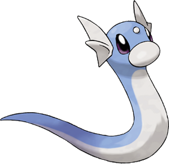

# Pikachu And Polynomials
## Or: Eevee And Exponents
## The math of Pokemon Go
Dan Conley

April 2019


## You remember Pokemon Go
* Walk around, catch Squirtles and stuff
* It was ridiculously popular for like two months in 2016
* Then people got sick of catching another goddamn Pidgey and stopped playing


## What is dead may never die
* I think that's a Game of Thrones line
* Are you interested yet?
* This has dragons too!
* They look like this though:




## There's more to do!
More Pokemon to catch, obviously, but it's simply a better *game* now:

* Daily quests
* Larger quests for mythical Pokemon
* Raids for strong/rare Pokemon, many of which require groups
* Friends
* Trading
* PVP


## We play in the Buffalo office!
* Check the "Pokemon Go" room
* It's an "official" community on [The Silph Road](https://thesilphroad.com/)
* If you want to get back into it, we have people from level ~10 to 40 (the max)
* There are also Discord/Telegram communities all over. I'm in the KenTon one and it's great.


## I was told there would be math
* Like the main series of games, it's pretty simple on its face
* My six year old plays! She can throw the balls and catch the pokey-mon and has a lot of fun.
* But also like the main games, things can get complex if you want to go down the Buneary hole
* It's simpler than the main games, but has many of the same principles


# CP and Plato's Cave


## CP
* Stands for "Combat Power"
* Is an indicator of how strong a Pokemon is
* Except... it's not actually used in combat
* Or anywhere, besides PVP leagues


## PVP leagues
* Great League: `CP 0`-`CP 1500`
* Ultra League: `CP 0`-`CP 2500`
* Master League: any CP


# But that's it.
## CP is a reflection of data, not the data itself


## how is CP formed
```
CPM = (a number based on level from 0.094-0.79030001)
stamina = (base stamina + stamina IV) * CPM
attack = (base attack + attack IV) * CPM
defense = (base defense + defense IV) * CPM

CP = MAX(10, FLOOR(Stamina^0.5 * Attack * Def^0.5 / 10))
```


# That was a lot of words
## Let's break it down


## IV
* Stands for *Individual Value*
* A number from `0`-`15`
* IVs for attack, defense and stamina
* (in the main games, also speed)


## "Appraise" helps track it down
Your team leader will tell you four things:

1. Its IVs as a percentage of "perfect"
2. Its top stat
3. What that top stat is
4. Its size (which is meaningless, in-game)

Except... in code. Each leader has different text that means the same thing.


## IVs are important
```
stamina = (base stamina + stamina IV) * CPM
```

* The *only difference* between Pokemon of the same level is their IVs
* A level 40 Salamence can be `CP 3,295` with `0/0/0` IVs
* It can also be `CP 3,749` with `15/15/15` IVs


## I thought you said we didn't care about CP
* You're paying attention!
* So let's look at DPS (damage per second)
* Salamence can have the move Dragon Tail, which does `13.64` DPS (PVE)
* level 40 Salamence with 0 attack IV does `((277 + 0) * 0.79030001) * 13.64 = 2985.9747217828`
* With 15 attack IV it's `3147.6701038288`, or over `161` higher


## Case study: Venusaur
* I have a `CP 828` Venusaur
* It's level `11.0`
* "caught my attention" / "best attribute is HP" / "certainly impressed by its stats"
* Those stats could mean it's `11/12/13` *or* `12/10/13`
* Powering it up should determine which


## Okay fine, do you want me to do algebra in my head for every Mankey I see?
* No, we have robots for that!
* Generally, take a screenshot and it analyzes the image for level/CP/HP
* iOS: [PokeGenie](https://itunes.apple.com/us/app/poke-genie/id1143920524), [PokeKeys](https://itunes.apple.com/us/app/pokekeys/id1335234519) (scan/rename from the keyboard!)
* Android: [CalcyIV](https://play.google.com/store/apps/details?id=tesmath.calcy) (even determines a range *before* you catch it), apparently also [PokeGenie](https://play.google.com/store/apps/details?id=com.cjin.pokegenie.standard)


## Bigger is better
* As close to `15/15/15` is ideal
* Why wouldn't you want more attack, defense, HP?


# Unless...


## Unless?
* Remember how CP only matters in PVP tiers?
* And how defense/stamina are `x^0.5` but attack is just `x`?
* This means that attack has a much bigger impact on CP, meaning you pass the Great League cap at a lower level, and therefore have a lower CPM


## Meet Lucario
* At `15/15/15`, the max level to be in Great League is `1467` at level `19.0`
* `146.15` attack, `92.58` defense, `108` stamina, or a stat product of `1461358`
* The "ideal" PVP IVs are `1/15/15` at level `20.5`, with a stat product of `1557667`


## We can't stop here, this is Munchkin country!
* This is splitting hairs, though: `15/15/15` is still 93.82% of the "ideal"
* In PVP it's much more important to have better base stats (ie the right Pokemon) and moves, and to know type efficiency
* That is: don't send a Grass type against a Fire type


## And you can keep descending
* [r/TheSilphRoad](https://www.reddit.com/r/thesilphroad) for general Pokemon Go news/insight
* [r/TheSilphArena](https://www.reddit.com/r/thesilpharena) for Silph PVP stuff
* [pokemonpvp.club IV spread](https://pokemonpvp.club/pvp/iv) is where I got the "ideal" IVs for PVP
* [PvPoke.com](https://pvpoke.com/) has things like [ranking for the next Silph PVP Cup](https://pvpoke.com/rankings/nightmare/1500/overall/)


## May is the Nightmare Cup
* [Fighting, Dark, Psychic types](https://silph.gg/nightmare-cup)
* No legendaries, mythicals, Sableye or Medichan
* We'll probably have our tournament the last week of May


# Now let's talk about parallel universes


## Just kidding, this isn't *that* weird
Sadly.

<iframe width="560" height="315" src="https://www.youtube.com/embed/kpk2tdsPh0A" frameborder="0" allow="accelerometer; autoplay; encrypted-media; gyroscope; picture-in-picture" allowfullscreen></iframe>


## But here watch BDG create the perfect Pokerap
<iframe width="560" height="315" src="https://www.youtube.com/embed/2cT6ULpScZA" frameborder="0" allow="accelerometer; autoplay; encrypted-media; gyroscope; picture-in-picture" allowfullscreen></iframe>
