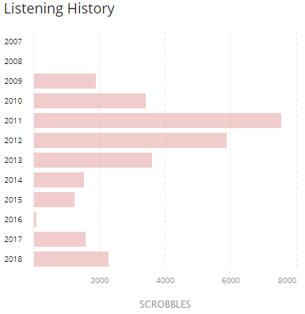
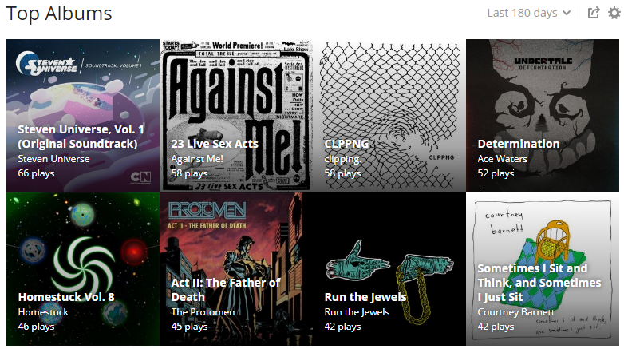

# Scrobbling on the command line
##(or: why do I only ever deal with APIs that make me terribly sad)
Dan Conley

## What the h\*ck is a scrobble
* [last.fm](//last.fm) is a website that tracks music you listen to
* Logging tracks is called "scrobbling"
* The tracks that have been scrobbled are also called "scrobbles"
* It's kind of a bad site
* But it gives you historical data

## Scrobbles per year

## Top artists per (time period)

## The caveat
* You can't enter scrobbles directly on their site
* A client has to do it
* There are integrations with Spotify, iTunes, Plex, etc
* But I've been listening to a lot of vinyl... how do you scrobble analog?

## Surely someone has figured this out
* They have! The [Universal Scrobbler](http://universalscrobbler.com/)
* But once you log in you discover you have to spend $5 to unlock most of the options
* I don't even know if I'll like their interface
* Plus, I know how to computer. I'll make my _own_ interface!

## Interlude: on the value of your labor
* "I'll just make my own" is great, and I do it a lot
* But your time and energy is worth something
* You can absolutely decide to spend your labor on a task instead of your money, especially if the results are "better"
* (for instance, I was fine doing this because I wanted to try a CLI go app)
* Just remember that it isn't "free"

## My solution: two repos
* [github.com/Sigafoos/lastfm](https://github.com/Sigafoos/lastfm): go interface for the last.fm api
* [github.com/Sigafoos/scrobble](https://github.com/Sigafoos/scrobble): CLI app using the above

## Usage
	> scrobble album # be prompted for title

	> scrobble album -t "slow riot for new zero kanada"

	# don't require a MusicBrainz ID
	> scrobble album -t "splendor dysphoria" -r=false

	# an individual track
	> scrobble track -a "Against Me!" -l "As the Eternal Cowboy" \
	  -t "Sink, Florida, Sink"

	# tab separated file, track\tartist\talbum
	> scrobble file -f ~/tracks.txt

## Behind the scenes
* It's compiled into a cross-platform binary
* It's compiled with an app key/secret, so people don't need to have go on their computer
* Prompts the user for last.fm username and password, exchanges that for a session token and saves that (not the password)

ie:

	go build -ldflags \
	"-X github.com/Sigafoos/scrobble/cmd.APIKey=<YourAPIKey>
	-X github.com/Sigafoos/scrobble/cmd.APISecret=<YourAPISecret>" \
	-o scrobble main.go

# Live demoooooooooooo

# I hate last.fm

## "Documentation"
* The API is abandoned, as far as I can tell
* Endpoint information is infuriatingly vague
* If they don't have an artist/album you can't add it (or suggest it)
* Sometimes albums have 0 tracks
* Each call has to have a "method signature"

## Method signatures
* Take each query param in the call
* Alphabetize by key
* Remove `?`, `&` and `=`
* Append your API secret
* md5 the string

## oh, also
* If you're scrobbling multiple tracks you use an array syntax
* `track[0]=Daniel&track[1]=Teacher%20I%20Need%20You`

> the parameter names MUST be sorted according to the ASCII table

* 0, 10, 11, 12 ... 19, 1, 20 ...

## Things I need to improve upon
* If you just run `scrobble`, offer the options (`track`, `album`, `file`) so Windows people can just click `scrobble.exe`
* Actually create releases
* Use `url.Values` instead of a string
* Right now, tracks with ampersands, question marks and equal signs don't work
* If an album has more than 50 tracks (the limit for a batch call) it just... won't work

## Bad
	for _, k := range SortOrder {
		if track, ok := mapped[k]; ok {
			artists += fmt.Sprintf("&artist[%s]=%s", k, track.Artist.Name)
			tracks += fmt.Sprintf("&track[%s]=%s", k, url.QueryEscape(track.Name))
			timestamps += fmt.Sprintf("&timestamp[%s]=%v", k, start+int64(track.AttrList.TrackNumber))
			albums += fmt.Sprintf("&album[%s]=%v", k, url.QueryEscape(a.Name))
			tracknumbers += fmt.Sprintf("&tracknumber[%s]=%v", k, track.AttrList.TrackNumber)
			durations += fmt.Sprintf("&duration[%s]=%v", k, track.Duration)
		}
	}

## The end
* zedar8 on last.fm
* linernotes.club is a Mastodon instance for music listeners
