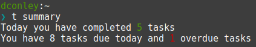

# Two Text Files and a CLI
## (Or: using todo.txt to track tasks)
Dan Conley

## A brief introduction
* I like to-do lists and other ways of tracking what I have to do

* I've used them for probably a decade plus, to varying degrees of success

## A history of dconley's productivity panaceas
* [Remember the Milk](https://www.rememberthemilk.com/)
* [Toodledo](https://www.toodledo.com/)
* Paper
* [2Do](https://www.2doapp.com/) (with Toodledo)
* [Todoist](https://todoist.com/)
* A halfassed [bullet journal](https://bulletjournal.com/)
* Todoist (again)

## Meet the new boss, same as the old boss
* Decide to use a system
* Use it really well!
* Usage declines somewhat
* Figure I can keep track of everything I need in my head
* Realize that isn't working; `50 GOTO 10`

## The problems inherent in the system
* Paper doesn't handle recurring tasks well
* (yes, bujo has a "monthly" page but I never used it well)
* Digital confines me to what the service offers
* Either way no way to bulk edit tasks

# Before we proceed

## But
* *I* need one
* Being on top of tasks gives a dopamine rush
* Managing it in my head means I forget things: bills, tasks, etc
* Basically literally Bojack Horseman's "Stupid Piece of Sh\*t" episode

## My s/favorite/newest obsession
* [todo.txt](http://todotxt.org)!
* At its heart is one text file, named -- shockingly -- `todo.txt`
* You also probably want a second, `done.txt`
* That can be it

## An example entry
* `Do Devtricks presentation`
* To mark an item as complete, prepend with an `x`
* `x Do Devtricks presentation`
* You can also add the date it was completed
* `x 2018-12-11 Do Devtricks presentation`

## A more in depth example
`(A) 2018-12-07 Do Devtricks presentation +Synacor @office due:2018-12-11 url:http://vm01.dconley.dev.opal.synacor.com/~dconley/slides/todotxt/`

* Priority is A-Z
* Projects start with `+`
* Contexts start with `@`
* Arbitrary key:value couples (none of which are "official"; some are widely supported)

## Add apps if you want
or if you prefer

don't

## This is all any to do system is
* Except free
* And human-readable
* And lightweight as h\*ck

## Apps!
* Windows: [todotxt.net](http://benrhughes.github.io/todotxt.net/)
* iOS: [SwiftoDo](http://swiftodoapp.com/)
* Android: Probably something, I dunno, get an iPhone
* Mac/Linux: the official [CLI app](https://github.com/todotxt/todo.txt-cli)
* To sync between devices, use *any file syncing solution* (I'm using Nextcloud hosted on my NAS), because it's *two text files*

I'll be focusing on the CLI, because it's what turns this from "simple but effective" into exactly what I need

## `man todo.sh`
* (first off, alias it to `t` or at least `todo`)
* `t ls`: see what's in the file, sorted by priority
* `t ls +Synacor`: filter by project (or context, or keyword, etc)
* `t add "Do Devtricks presentation +Synacor"`
* Tasks are given a numeric id (their line number in the file)
* `t do 23` to do a task
* `t pri 413 V` to prioritize

## The key feature
* Plugins!
* Turn "I wish it did X" into "oh cool it does X now"
* Plenty exist already, but if you can do some scripting (and you're attending Devtricks, so *chances are...!*) you can make your own

## Making a plugin
* Define `TODO_ACTIONS_DIR` in your config
* Have a file that's executable, ie `test`
* `t test` now works as a command
* It will be given a bunch of environment variables, including the color scheme and file locations

## Example: `summary`
	#!/bin/bash
	
	if [ $1 == "usage" ]; then
		echo "  summary"
		echo "    Takes no arguments; produces a summary of tasks done and due today"
	else
		$TODO_FULL_SH archive > /dev/null # archive tasks to clean up line numbers
		completed_goal=5
		pending_tasks=$(ack "due:$(date --rfc-3339 date)" \
			$TODO_FILE | wc -l)
		overdue_tasks=$($TODO_FULL_SH due2 overdue)
		completed_tasks=$(cat $DONE_FILE | cut -d' ' -f2 \
			| ack $(date --rfc-3339 date) | wc -l)
		undated_tasks=$(ack -v 'due:\d{4}-\d{2}-\d{2}' \
			$TODO_FILE | ack '.' | wc -l)

Then print with bash's colored escape sequences

## Example: due dates
* If a task doesn't have a due date I will (probably) never do it
* Uses `due:YYYY-MM-DD`
* I didn't write it: [Matthew Zimmerman did](https://github.com/mdzimmerman/todo.txt-cli-due)
* (as a side note, he does Advent of Code!)
* Can list what's overdue/due today, reschedule, view a weekly agenda

## Example: recurring tasks
* A few examples exist
* Uses `rec:1m` for 1 month
* Two issues: I need to be able to specify days of the week (ie don't repeat on weekends)
* They also tend to be `t rec 23` instead of `t do 23`

# I could live with this
## But I don't *have* to!

## Even better: `command`
* You can make a plugin with the name of a built-in command
* Accessing the built-in command can be done with `command X`
* So... I made a `do` plugin to handle my recurring tasks
* Which calls `command do` after conditionally creating a new task
* It handles `rec:3d` but also `rec:mtwrf`

## Plugins I've made/use
* `do`: handle custom repeats
* `due` (not mine): handle due dates
* `due2`: an unfinished due date implementation
* `review`: generate a weekly review/"trigger list" for thinking of new tasks
* `summary`: high-level counts of tasks
* I also have a partially functional time tracking system working, sort of implementing [Timewarrior](https://timewarrior.net/) with the todo.txt format

## Make your system work for you
* If I want a feature, I can make that feature happen in an evening
* I don't have to use the command line system they made. I could make a different one or just, like, vim
* (there is a vim plugin but I didn't like it)
* Use `cat`, `ack`/`grep`, `cut`, etc! (that's what the CLI does behind the scenes, mostly)

## System-agnostic productivity tips
* "Productivity" systems only work for you as long as they *work* for *you*. If it works, great! If it stops, ditch it!
* At the start of the day, think of what you have to do. Make a task for everything, unless making tasks would take longer than doing them.
* It's fine to not do everything or let things spill (unless it's time sensitive but I'm not your boss)
* If you keep putting something off: do you *actually* have to do it? Either do it or delete it.
* Essentially: make a plan, stick to the plan, always deliver!

## just like in that movie where THE BIRDS HAVE TEETH

## Resources
* [todotxt.org](http://todotxt.org/)
* [Plaintext Productivity](https://plaintext-productivity.net/) (Windows focused but I've been using the directory structure/etc)

# The end
<small>im sorry i made you look at the bird with teeth</small>
